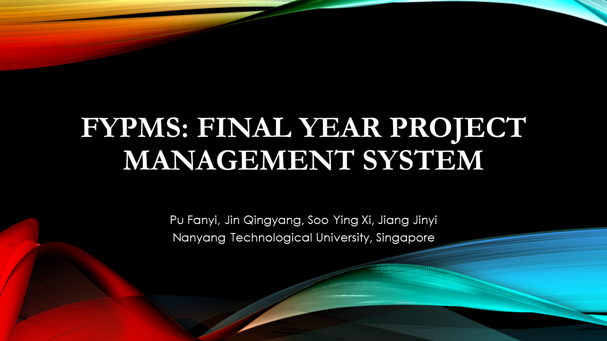

[](https://pufanyi.github.io/FYPMS/)

**As we're approaching graduation, we'd really appreciate it if you gave this project a star if you find it helpful! 🙏**

NTU AY2022/23 Semester 2 SC2002 Group Project - Final Year Project Management System (FYPMS).

Final Year Project Management System (FYPMS) is a Java console application that utilizes object-oriented concepts to efficiently manage final year project settings. The program is designed with a focus on reusability, extensibility, and maintainability, allowing for easy upgrades and future development. It provides flexibility to accommodate different user types and their requirements.

The initial password for every user is `password`.

## Links

- [Main Page](https://pufanyi.github.io/FYPMS)
- [GitHub Repository](https://github.com/pufanyi/FYPMS)
- [Documentation](https://pufanyi.github.io/FYPMS/docs)
- [Report](docs/report)
- [Presentation Video](https://youtu.be/8FikWzfHlLA)

## Team Members

We are a group 6 from tutorial group A50, Nanyang Technological University, Singapore. There are 4 members in our group:

| Name         | Github Account                                  | Email                 |
|--------------|-------------------------------------------------|-----------------------|
| Pu Fanyi     | [pufanyi](https://github.com/pufanyi)           | [FPU001@e.ntu.edu.sg](mailto:FPU001@e.ntu.edu.sg) |
| Jin Qingyang | [jin-qingyang](https://github.com/jin-qingyang) | [JINQ0003@e.ntu.edu.sg](mailto:JINQ0003@e.ntu.edu.sg) |
| Jiang Jinyi  | [Jinyi087](https://github.com/Jinyi087)         | [D220006@e.ntu.edu.sg](mailto:D220006@e.ntu.edu.sg) |
| Soo Ying Xi  | [niyaojiayou](https://github.com/niyaojiayou)   | [D220001@e.ntu.edu.sg](mailto:D220001@e.ntu.edu.sg)  |

## Highlights

- **Reflection**: The interface `Model` uses reflection to convert between classes and strings, enabling dynamic handling of model data without manual mapping.
- **Generic Repository Class**: `Repository<Model>` class with generics allows for flexible data storage and retrieval for any model type, reducing duplication and improving maintainability.
- **SHA-3 Password Encryption**: User passwords are encrypted using the SHA-3 algorithm for enhanced
security.
- **Batch CSV Data Import**: The system supports batch importing of initial data from CSV files, making it convenient to process large datasets in chunks.
- **Factory Design Pattern**: The factory pattern is used to quickly generate requests based on different requirements, enhancing system scalability and adaptability.
- **Data Syncing**: The system automatically saves data and synchronizes it with the database, ensuring that data is not lost in the event of a crash. You can even open multiple instances of the program and they will all be synchronized.
- **JUnit 5**: We used JUnit 5 to test our classes, it helps to ensure the correctness and robustness of our code.

## Features

- [x] Student
  - [x] View my profile
  - [x] Change my password
  - [x] View project list
  - [x] View my project
  - [x] View my supervisor
  - [x] Register for a project
  - [x] Deregister for a project
  - [x] Change title for a project
  - [x] View history and status of my requests
- [x] Supervisor
  - [x] View my profile
  - [x] Change my password
  - [x] Create a project
  - [x] View all my projects
  - [x] Modify title of projects
  - [x] View all pending student requests
  - [x] Approve/Reject student requests
  - [x] Submit request for transferring
  - [x] View all incoming/outgoing requests' history and status
- [x] Supervisor
  - [x] View My Profile
  - [x] Change My Password
  - [x] View All Projects
  - [x] View Pending Requests
  - [x] View All Requests' History and Status
  - [x] Accept or Reject Requests
  - [x] Generate Project Details

## Build

Download the project from GitHub.

```bash
git clone https://github.com/pufanyi/FYPMS.git
```

Use JetBrains IntelliJ IDEA to build the project.

The project is built with Java 17.

The MANIFEST.MF file is located at `src/META-INF/MANIFEST.MF`.

## Run

The built jar file is located at `out/artifacts/FYPMS_jar/FYPMS.jar`.

There is a shell script `run.sh` and a Windows command script `run.cmd` to run the program.

Or you could run the jar file with the following command:

```bash
java -jar ./out/artifacts/FYPMS_jar/FYPMS.jar
```

Also, you can also use JetBrains IntelliJ IDEA to run the project.

The main class is `src/main/Main.java`.

## Test

The java class `src/test/HardReload.java` is used to hard reload the database.

## UML Class Diagram

The uml diagram is generated by [draw.io](https://draw.io/).

You can refer to the [project main page](https://pufanyi.github.io/FYPMS) for the UML class diagram.

[Here](umls) is the source code of the UML class diagram.

## BibTeX

```bibtex
@software{Pu_FYPMS_Final_Year_2023,
  author  = {Pu, Fanyi and Jin, Qingyang and Soo, Ying Xi and Jiang, Jinyi},
  month   = apr,
  title   = {{FYPMS: Final Year Project Management System}},
  year    = {2023}
}
```

## License

[MIT](LICENSE) © Pu Fanyi, Jin Qingyang, Soo Ying Xi, Jiang Jinyi
